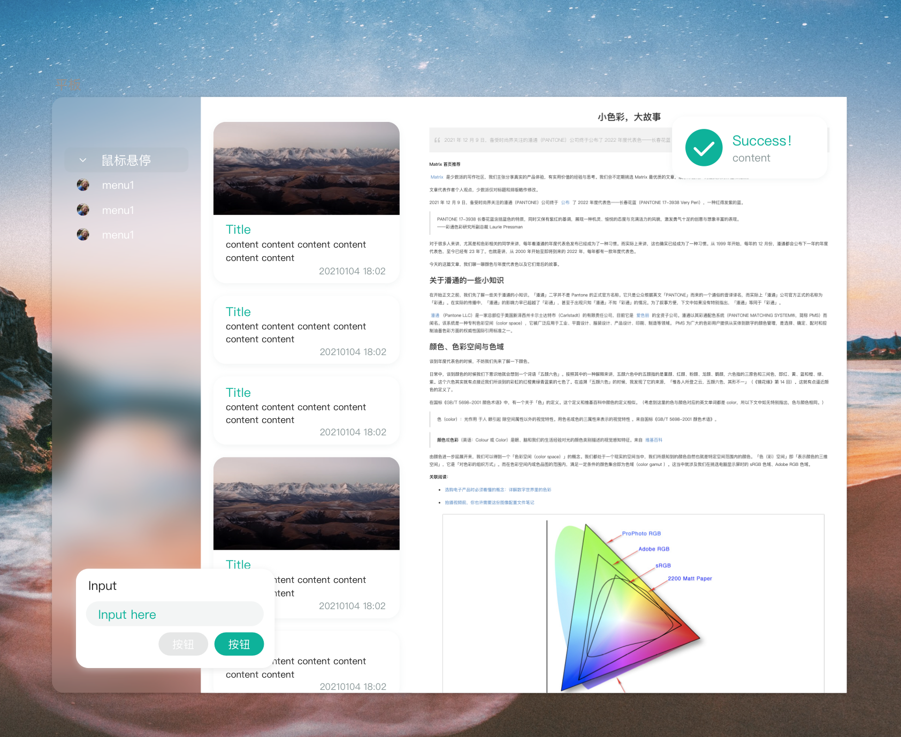

# GKDesign 设计规范

> 自我约束

参考于 [Ant Design](https://ant.design/docs/spec/introduce-cn) 设计规范，约束 APP UI 设计，在保持美观简约的设计下，提高开发效率，减少UI开发的时间。

## 总结 Result

- 风格统一
- 页面元素不宜过多
- 间距要高度统一
- 一个页面下，颜色不宜过多

## 间距 Space

- 以 8 为基本单位
  
## 字号 Font Size

- 小
  - 10
  - 12
- 中
  - 14
  - 16
- 大
  - 20
  - 24
- 特大
  - 34
  - 48

## 颜色 Color

- 一个主色调
- 背景色
- 醒目色
- 黑色
- 白色
- 灰色

## 圆角 Radius

- 0
- 4
- 16

## Personal

<code>

Green

    #0EB29A
    #F5FDFF
    #DDF0C2
    #8C999A

    #FD5E53
    #F9FCFB
    #B0EACD
    #21BF73

    #B6EB7A
    #F7F7EE
    #FB7813
    #17706E

    #AA3A3A
    #A4B787
    #F4F4F4
    #F8E4B7

    #FAF1E6
    #FDFAF6
    #E4EFE7
    #064420

Blue

    #F9F9F9
    #FFE0AC
    #FFACB7
    #6886C5

    #DDF3F5
    #A6DCEF
    #F2AAAA
    #E36387

    #F6F5F5
    #D3E0EA
    #1687A7
    #276678

    #F4F9F9
    #CCF2F4
    #A4EBF3
    #AAAAAA

    #053742
    #39A2DB
    #A2DBFA
    #E8F0F2

</code>